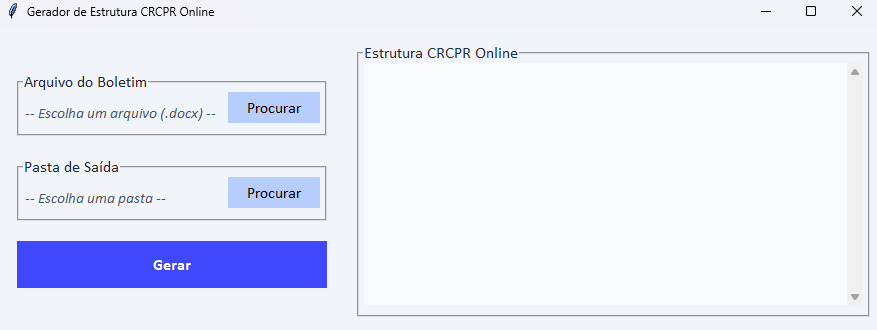

# gonline_gui
Ferramenta para manipulação de arquivos, visando agilizar a criação de uma newsletter semanal pro estágio.

#### Como funciona 
1. Copia o arquivo .docx pra uma pasta da sua escolha 
2. Transforma o arquivo .docx em .html
3. Busca todos os links e salva em um .txt (se o link tiver uma formatação específica, ele edita de forma diferente)
4. Abre o arquivo criado para visualização

#### Para testar
1. Faça  (versão Windows) e do 
2. Selecione o Boletim como o arquivo de entrada, e uma pasta qualquer no seu computador como pasta de saída
3. Clique em gerar
